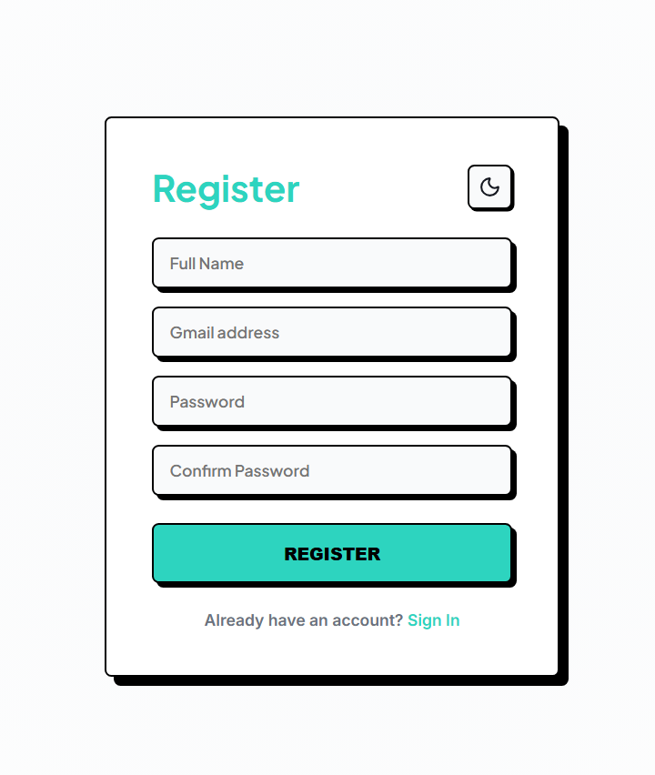
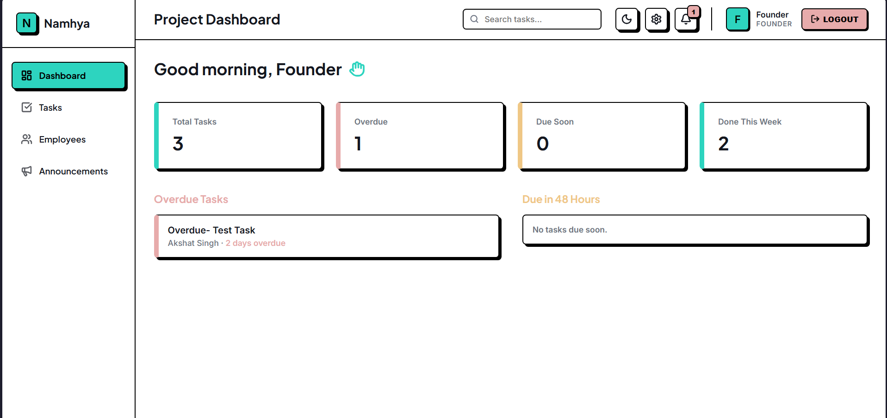
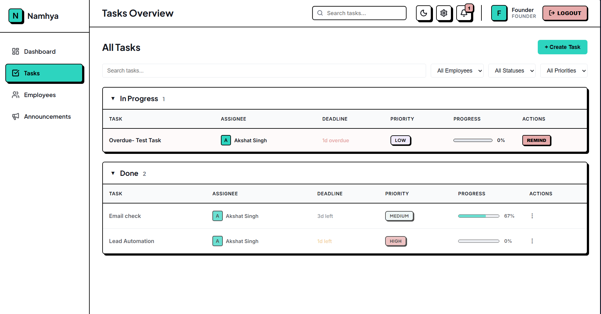
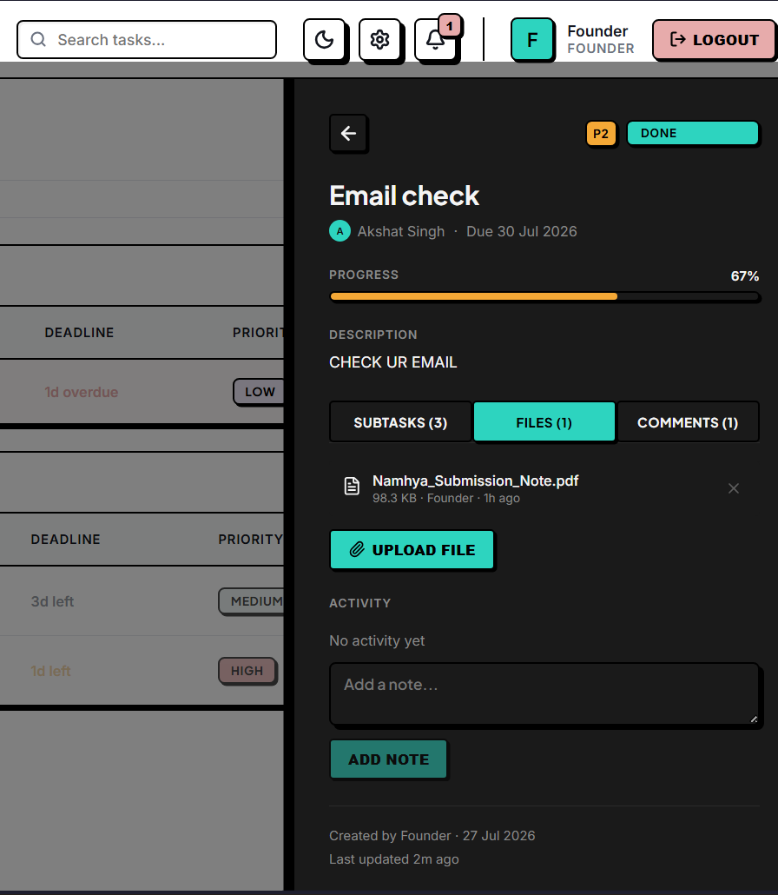
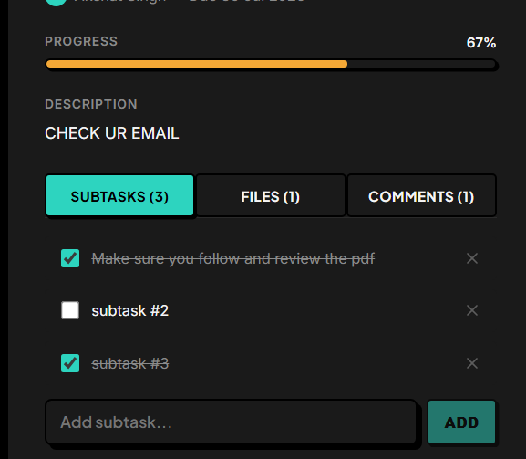
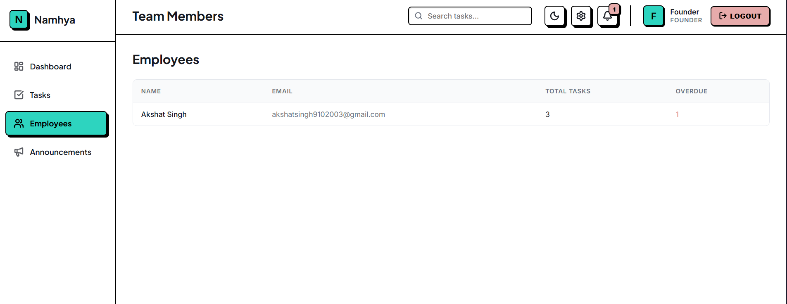
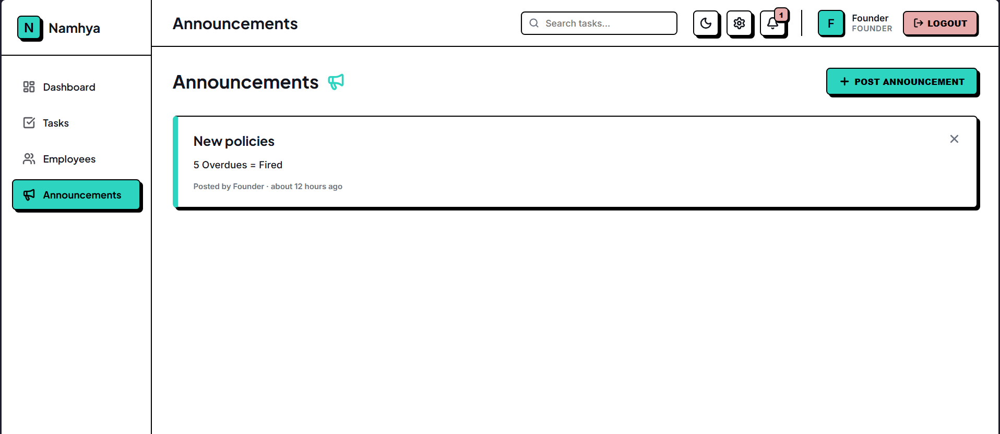
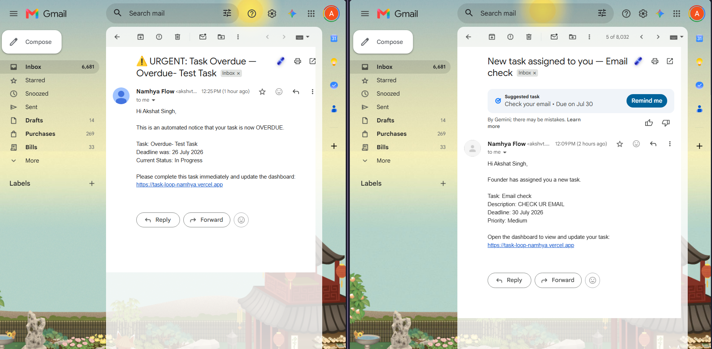

# Namhya Tasks — Founder's Tour & Platform Guide 🚀

Welcome to **Namhya Tasks** (Namhya Flow), a state-of-the-art SaaS workspace designed specifically for ambitious founders and high-velocity teams. Built with a bold **Neo-Brutalist aesthetic**, this platform eliminates visual clutter and replaces it with tactile, high-contrast, sticker-like elements that make tracking company goals, deadlines, and team accountability effortless.

---

## 📸 Required Screenshots Guide

To complete the visual tour in this document, please take the following screenshots from your app and place them inside the `screenshots/` folder in the project root with these exact filenames:

| Filename | Where to Capture | What to Show |
| :--- | :--- | :--- |
| `employee-register.png` | `/register` | The employee registration form where new team members sign up using their Gmail address. |
| `dashboard-overview.png` | `/` (Dashboard) | The main command center showing the chunky stat cards (Total Tasks, Overdue, Due Soon, Done) and the quick reminder buttons. |
| `tasks-board.png` | `/tasks` | The grouped tasks table showing collapsible To Do, In Progress, Blocked, and Done sections with priority pills and progress bars. |
| `task-detail-drawer.png` | Click any task | The slide-out Task Detail Drawer on the right side, showing status dropdowns, priority badges, and tabs. |
| `subtasks-checklist.png` | Drawer -> Subtasks tab | A task drawer with a checklist of subtasks and the visual progress bar at 50% or 100%. |
| `team-management.png` | `/employees` | The Team Members page showing the employee roster and task statistics per employee. |
| `announcements-feed.png` | `/announcements` | The Announcements feed showing company-wide broadcast cards posted by the Founder. |
| `email-notification.png` | Your Gmail inbox | An example of an automated email alert received in Gmail (e.g., "New Task Assigned" or "Overdue Reminder"). |

---

## 🏢 Platform Features & Screen-by-Screen Tour

### 1. Secure Role-Based Authentication
Namhya Tasks is built around a two-tier organizational hierarchy: **The Founder** and **The Employees**.

* **Founder Access**: The founder account is the executive controller of the workspace. Selecting the **Founder** role on the login screen authenticates against exclusive executive privileges. Only the founder can delete tasks, post company-wide announcements, and trigger broadcast reminders.
* **Employee Registration**: New employees click *"Don't have an account? Register"* to self-onboard. They select the **Employee** role, enter their verified Gmail address, and instantly gain access to their assigned tasks and team collaboration feeds.



---

### 2. The Command Center: Executive Dashboard
When you log in as a Founder, you are greeted by the **Executive Dashboard**—designed to give you an immediate pulse on productivity without digging through spreadsheets.



* **Chunky Pulse Cards**: Four high-contrast stat cards immediately show you:
  * **Total Tasks**: Overall active workflow in the company.
  * **Overdue Tasks**: Deliverables that have missed their deadlines (highlighted in urgent red).
  * **Due Soon**: Deliverables approaching their deadline within the next 48 hours (highlighted in caution yellow).
  * **Done This Week**: Completed milestones to celebrate team momentum.
* **One-Click Reminders**: Next to overdue and due-soon items, you will find physical, push-down **"Remind"** buttons. Clicking this dispatches an instant, automated email directly to the employee's Gmail inbox urging action.

---

### 3. Tasks Overview & Board
The Tasks page is where day-to-day execution happens. Designed like tactile physical board games, tasks are grouped cleanly by their operational lifecycle.



* **Lifecycle Groups**: Easily collapse or expand task groups: **To Do**, **In Progress**, **Blocked** (high visibility for removing bottlenecks), and **Done**.
* **Visual Progress Bars**: Every task row features a built-in progress bar that fills up as employees complete their subtask checklists.
* **Instant Filtering**: Filter by assignee, priority (**High / Medium / Low**), or status in one click.

---

### 4. Deep Focus Task Drawer (The Work Hub)
Clicking on any task opens the **Deep Focus Task Drawer** from the right side of the screen. This is a comprehensive collaborative workspace for that specific deliverable.



#### 📋 Subtasks & Checklists
Why overwhelm an employee with a massive project? Break big tasks down into bite-sized, actionable checklists.
* As employees tick off subtasks, the computed progress bar updates in real time (e.g., 3 out of 4 completed = 75% progress).
* If a task has no subtasks, managers can manually drag or set the progress percentage.



#### 📎 Cloud Attachments
No more lost email attachments or broken links.
* Employees and founders can upload reference documents, PDF briefs, spreadsheets, and design mockups directly to the task.
* All files are stored securely in the cloud and open in a single click with clear file size and author labels.

#### 💬 Real-Time Discussion & Comments
Keep task-specific conversations exactly where they belong—on the task card itself.
* Use the **Comments** tab for freeform team discussions, clarifying questions, and feedback.
* Use the **Activity** tab to see an immutable audit log of status changes and official notes.

---

### 5. Team Management & Company Announcements
Keep your team aligned and informed without calling unnecessary meetings.



* **Team Roster (`/employees`)**: View all registered team members, their active task load, and their completion rates.
* **Company Announcements (`/announcements`)**: Have major news, a policy change, or a celebratory milestone? Use the **"+ Post Announcement"** megaphone button to broadcast high-visibility cards to every employee's feed.



---

## ⚙️ Behind the Scenes: The Powerhouse Engine

While Namhya Tasks looks simple and intuitive on the surface, it is powered by enterprise-grade cloud technologies running silently in the background:

```
+-----------------------------------------------------------------------+
|                         NAMHYA TASKS CLOUD                            |
+---------------------+---------------------------+---------------------+
|    ⏰ CRON JOBS     |        ✉️ BREVO         |    ☁️ CLOUDINARY    |
|  Automated Time     |   Transactional Email   |  Secure Cloud Vault |
|  Keeper & Scheduler |      Delivery Engine    |  for All Attachments|
+---------------------+---------------------------+---------------------+
```

### ⏰ Automated Timekeeper (Cron Jobs)
You don't need to manually check deadlines every morning. We have built an automated background timekeeper (**Cron Job**) into the server:
* Every night (or at scheduled intervals), the server sweeps through all active tasks.
* It automatically flags tasks that have become overdue and dispatches automated reminder digests so nothing slips through the cracks.

### ✉️ Transactional Email Delivery (Brevo)
To ensure employees never miss an assignment, Namhya Tasks is integrated with **Brevo** (formerly Sendinblue), an enterprise transactional email engine.
* **When are emails sent?**
  1. **New Task Assignment**: The moment a founder assigns a task to an employee, an email arrives in their Gmail inbox with task details and deadline.
  2. **Manual & Automated Reminders**: When a founder clicks "Remind" on an overdue task, or when the background Cron Job triggers, Brevo instantly delivers a high-priority reminder email.
  3. **Broadcasts**: Important system alerts reach your employees where they work.



### ☁️ Secure Attachment Vault (Cloudinary)
When team members upload files, spreadsheets, or images to a task, where do they go?
* We integrate with **Cloudinary**, a leading cloud media management platform.
* Files are uploaded over encrypted channels, stored in a high-speed global CDN (Content Delivery Network), and served instantly when a team member clicks download in the Task Drawer.

---

## 🎨 Why Neo-Brutalism? (The Design Philosophy)
Traditional enterprise software is bland, gray, and fatiguing. Namhya Tasks uses a curated **Neo-Brutalist** design language featuring:
* **2px Solid Black Borders & Offset Shadows**: Creates a tactile, 3D "sticker" feel that makes interactive buttons and cards unmistakable.
* **High-Contrast Typography**: Uses *Plus Jakarta Sans* and *Inter* for maximum legibility.
* **Instant Theme Switching**: Click the ☀️ / 🌙 icon in the TopBar to toggle between a vibrant Light Mode and a deep-focus Dark Mode with zero page reloads.

---

## 🚀 Quick Start (Running Locally)

For technical administrators setting up the workspace:

1. **Clone & Install Dependencies**:
   ```bash
   git clone https://github.com/Akshvt/TaskLoop.git
   cd TaskLoop
   # Install backend dependencies
   cd backend && npm install
   # Install frontend dependencies
   cd ../frontend && npm install
   ```

2. **Environment Variables**:
   Ensure your `backend/.env` file is populated with your MongoDB URI, Cloudinary API credentials, and Brevo SMTP API keys.

3. **Launch the Workspace**:
   ```bash
   # In terminal 1 (Backend API Server - port 5001)
   cd backend && npm start

   # In terminal 2 (Frontend UI - port 5173)
   cd frontend && npm run dev
   ```
   Open your browser to `http://localhost:5173` and enjoy the tour!
